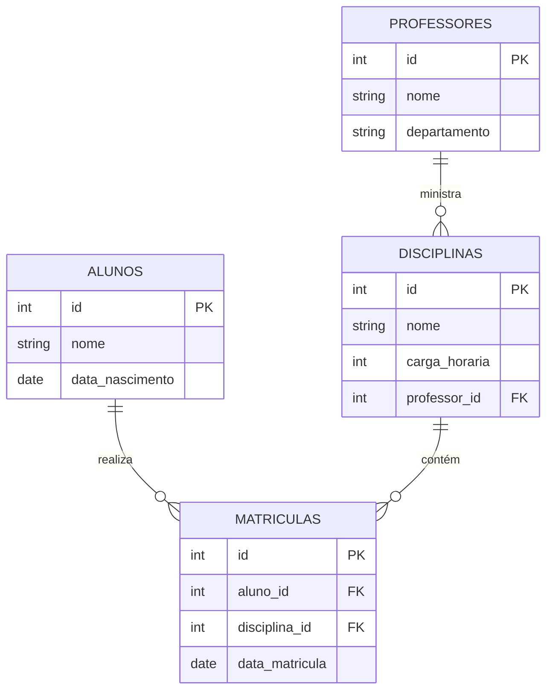

# Sistema de Gerenciamento Escolar

Este projeto é uma API RESTful desenvolvida em Python utilizando o framework Flask e o PostgreSQL (via biblioteca `psycopg2-binary`). O objetivo principal é gerenciar dados de um sistema escolar, permitindo operações de Create, Read, Update e Delete (CRUD) para as principais entidades: Professores, Disciplinas, Alunos e Matrículas.

## Funcionalidades

- **Verificação de Conexão com o Banco de Dados:**  
  Um endpoint (rota `/`) foi criado para testar a conexão com o PostgreSQL, garantindo que a aplicação está corretamente configurada e se comunicando com o banco.

- **CRUD para Professores:**  
  - Listar todos os professores (`GET /professores`)
  - Consultar um professor específico (`GET /professores/<id>`)
  - Criar um novo professor (`POST /professores`)
  - Atualizar os dados de um professor (`PUT /professores/<id>`)
  - Deletar um professor (`DELETE /professores/<id>`)

- **CRUD para Disciplinas:**  
  - Listar todas as disciplinas (`GET /disciplinas`)
  - Consultar uma disciplina específica (`GET /disciplinas/<id>`)
  - Criar uma nova disciplina (`POST /disciplinas`)
  - Atualizar os dados de uma disciplina (`PUT /disciplinas/<id>`)
  - Deletar uma disciplina (`DELETE /disciplinas/<id>`)

- **CRUD para Alunos:**  
  - Listar todos os alunos (`GET /alunos`)
  - Consultar um aluno específico (`GET /alunos/<id>`)
  - Criar um novo aluno (`POST /alunos`)
  - Atualizar os dados de um aluno (`PUT /alunos/<id>`)
  - Deletar um aluno (`DELETE /alunos/<id>`)

- **CRUD para Matrículas:**  
  - Listar todas as matrículas (`GET /matriculas`)
  - Consultar uma matrícula específica (`GET /matriculas/<id>`)
  - Criar uma nova matrícula (`POST /matriculas`)
  - Atualizar os dados de uma matrícula (`PUT /matriculas/<id>`)
  - Deletar uma matrícula (`DELETE /matriculas/<id>`)

## Estrutura do Banco de Dados

O banco de dados PostgreSQL é composto por quatro tabelas, definidas conforme abaixo:

- **Professores:**  
  - `id`: Identificador único (PK)  
  - `nome`: Nome do professor  
  - `departamento`: Departamento ao qual o professor pertence

- **Disciplinas:**  
  - `id`: Identificador único (PK)  
  - `nome`: Nome da disciplina  
  - `carga_horaria`: Carga horária da disciplina  
  - `professor_id`: Referência ao professor responsável (FK)

- **Alunos:**  
  - `id`: Identificador único (PK)  
  - `nome`: Nome do aluno  
  - `data_nascimento`: Data de nascimento do aluno

- **Matrículas:**  
  - `id`: Identificador único (PK)  
  - `aluno_id`: Referência ao aluno matriculado (FK)  
  - `disciplina_id`: Referência à disciplina matriculada (FK)  
  - `data_matricula`: Data em que a matrícula foi realizada

## Pré-requisitos

- Python 3.x
- PostgreSQL

## Instalação

1. **Clone o repositório:**

   ```bash
   git clone <URL_DO_REPOSITÓRIO>
   cd <NOME_DO_DIRETÓRIO>
